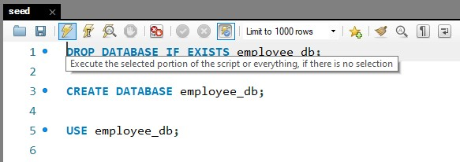
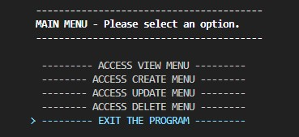

# Employee Tracker

 

## Description

This is a node application that acts as a Central Management System for a company.

## Installation

1. Make sure you have [node.js](https://nodejs.dev/) installed on your local machine.
2. Make sure you have [MySQL Community Server](https://dev.mysql.com/downloads/mysql/) and [MySQL Community Workbench](https://dev.mysql.com/downloads/workbench/) installed on your local machine, and set up the login credentials.
3. You'll need to seed the database by running MySQL Community Workbench, opening up `./assets/seed.sql` and executing it:



4. Clone or download the repository files onto your local machine.
5. Set up your MySQL credentials on a `.env` file in the root directory of the repository, with the following inside it:
```
    USER="yourUsername"
    PASS="yourPassword"
```
6. Navigate to the repository folder on your local machine in a CLI, and run the following to install all dependencies:
```
    npm install
```

## Usage

Navigate to the repository folder on your local machine in a CLI, and run the following to start the application:
```
    npm start
```
Menu navigation is done through the arrow keys, and enter/return to confirm your selection. In order to cleanly exit the application you'll need to confirm the EXIT THE PROGRAM option in the main menu.



If the program is unresponsive, you can always end the process with `Ctrl/cmd + C`.

A video demonstration of all functionality is available [here](https://youtu.be/wzc93dHezMo).